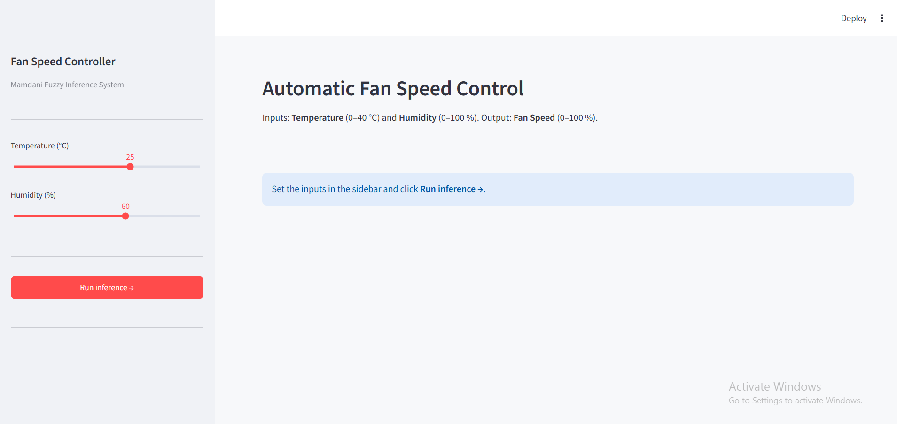

<div align="center">

#  Automatic Fan Speed Control using Fuzzy Logic

### A Mamdani Fuzzy Inference System for Intelligent Fan Speed Regulation.


An interactive web application that demonstrates **Mamdani-type fuzzy inference** for controlling fan speed based on ambient **temperature** and **humidity**. Every step of the inference pipeline from fuzzification to centroid defuzzification  is visualised in real time.

</div>

---

## 📸 Screenshots

<div align="center">

#### Dashboard & Input Controls


#### Result Summary


#### Step 1 — Membership Functions


#### Step 2 — Fuzzification


#### Step 3 — Rule Evaluation


#### Step 4 — Implication


#### Step 5 — Aggregation


#### Step 6 — Defuzzification


#### Final Computed Output


</div>

---

## ✨ Features

| Feature | Description |
|---|---|
| 🎛️ **Interactive Controls** | Adjust temperature (0–40 °C) and humidity (0–100 %) via sidebar sliders |
| 📊 **Step-by-Step Visualization** | See every stage of the Mamdani FIS pipeline rendered as charts |
| 🔺 **Triangular Membership Functions** | Three linguistic terms per variable with clear visual overlays |
| 📐 **Rule Evaluation Table** | All 9 rules displayed with computed firing strengths |
| ✂️ **Implication & Aggregation** | Clipped consequent sets and pointwise-max aggregation shown graphically |
| 🎯 **Centroid Defuzzification** | Final crisp output computed via centre-of-gravity method |
| 🎨 **Custom Themed UI** | Dark-mode design with a cohesive color palette |

---

## 🏗️ Architecture

```
┌──────────────────────────────────────────────────────────┐
│                     Streamlit UI (app.py)                │
│    Sidebar controls  ·  Layout  ·  Pipeline orchestration│
└──────────┬──────────────────────────────────┬────────────┘
           │                                  │
           ▼                                  ▼
┌────────────────────┐            ┌────────────────────────┐
│  fuzzy_engine.py   │            │      charts.py         │
│  ─────────────────  │            │  ──────────────────────│
│  • Universes        │  result ──▶│  • Membership plots    │
│  • Membership Fns   │            │  • Fuzzification       │
│  • Rule base (9)    │            │  • Rule table          │
│  • Fuzzification    │            │  • Implication          │
│  • Implication      │            │  • Aggregation          │
│  • Aggregation      │            │  • Defuzzification      │
│  • Defuzzification  │            └────────────┬───────────┘
└────────────────────┘                         │
                                               ▼
                                   ┌──────────────────────┐
                                   │     theme.py         │
                                   │  ────────────────────│
                                   │  Color palettes      │
                                   │  CSS injection       │
                                   │  Design tokens       │
                                   └──────────────────────┘
```

---

## 📁 Project Structure

```
├── app.py              # Streamlit entry point — UI layout & pipeline orchestration
├── fuzzy_engine.py     # Core Mamdani FIS — membership functions, rules, inference
├── charts.py           # Matplotlib visualizations for each inference step
├── theme.py            # Design tokens, color palettes, and custom CSS
├── screenshots/        # App screenshots used in this README
├── practice/
│   └── main.py         # Standalone CLI implementation for experimentation
├── requirements.txt    # Python dependencies
└── README.md
```

---

## 📏 Fuzzy Rule Base

The system uses **9 rules** mapping two inputs to one output:

| # | Temperature | Humidity | → Fan Speed |
|:-:|:-----------:|:--------:|:-----------:|
| 1 | Cold        | Low      | **Slow**    |
| 2 | Cold        | Medium   | **Slow**    |
| 3 | Cold        | High     | **Medium**  |
| 4 | Warm        | Low      | **Slow**    |
| 5 | Warm        | Medium   | **Medium**  |
| 6 | Warm        | High     | **Fast**    |
| 7 | Hot         | Low      | **Medium**  |
| 8 | Hot         | Medium   | **Fast**    |
| 9 | Hot         | High     | **Fast**    |

**Operator:** AND = min &nbsp;·&nbsp; OR = max &nbsp;·&nbsp; Implication = clip &nbsp;·&nbsp; Defuzzification = centroid

---

## 🚀 Getting Started

### Prerequisites

- **Python 3.8+**
- **pip** (Python package manager)

### Installation

1. **Clone the repository**
   ```bash
   git clone https://github.com/darpanhh/fuzzy_logic.git
   cd fuzzy_logic
   ```

2. **Create and activate a virtual environment**
   ```bash
   python -m venv venv

   # Windows
   .\venv\Scripts\activate

   # macOS / Linux
   source venv/bin/activate
   ```

3. **Install dependencies**
   ```bash
   pip install -r requirements.txt
   ```

4. **Launch the app**
   ```bash
   streamlit run app.py
   ```

   The app will open automatically at `http://localhost:8501`.

---

## 🧠 How It Works

The application follows the **six-step Mamdani fuzzy inference pipeline**:

1. **Membership Functions** — Define triangular fuzzy sets for each variable
2. **Fuzzification** — Map crisp inputs to membership degrees
3. **Rule Evaluation** — Compute firing strength of each rule using AND (min)
4. **Implication** — Clip each consequent membership function at its rule strength
5. **Aggregation** — Combine all clipped sets via pointwise maximum (OR)
6. **Defuzzification** — Extract crisp output using centroid (centre of gravity)

---

## 🛠️ Tech Stack

| Technology | Purpose |
|---|---|
| [Streamlit](https://streamlit.io/) | Web UI framework |
| [scikit-fuzzy](https://pythonhosted.org/scikit-fuzzy/) | Fuzzy logic computations |
| [NumPy](https://numpy.org/) | Numerical operations |
| [Matplotlib](https://matplotlib.org/) | Chart generation |
| [SciPy](https://scipy.org/) | Scientific computing utilities |

---

## 👥 Team Members

| Name | Roll Number |
|---|---|
| Darpan Giri | 080BCT024 |
| Kushal Gautam | 080BCT040 |
| Alex Shrestha | 080BCT012 |
